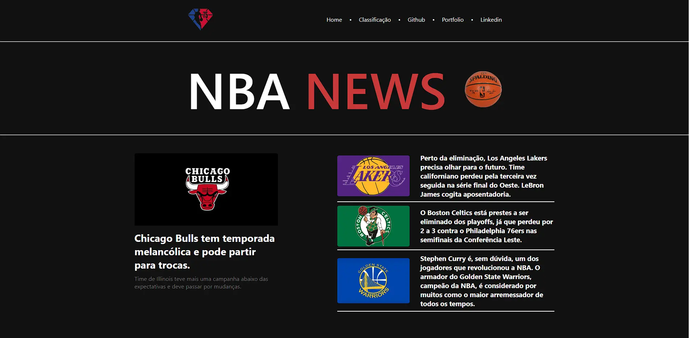

<h1 align="center"> NBA News </h1>

NBA News é meu primeiro projeto com angular. Bootcamp potência Tech Angular Developer - Powered by iFood 

  <a href="#-tecnologias">Tecnologias</a>&nbsp;&nbsp;&nbsp;|&nbsp;&nbsp;&nbsp;
  <a href="#-projeto">Projeto</a>&nbsp;&nbsp;&nbsp;

 

  

## 🚀 Tecnologias

Esse projeto foi desenvolvido com as seguintes tecnologias:

- HTML e CSS
- TypeScript
- Angular
- Git e Github

## 💻 Projeto

Desenvolvido através do projeto base de um blog feito em Angular, proposto pelo professor Felipe durante o bootcamp da DIO.

- [Acesse o projeto](https://gabtech1.github.io/angular-blog/)

---

:wave: